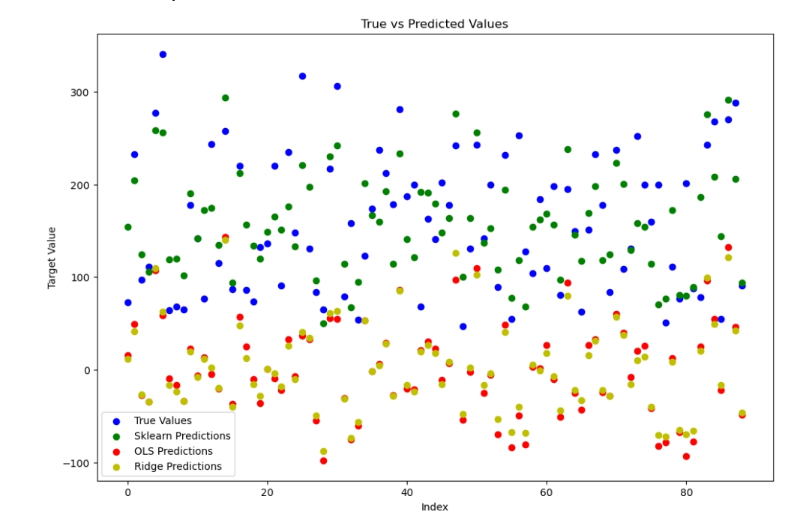

# 机器学习第一次作业
## 项目的简单介绍
该项目通过使用不同的回归模型来预测糖尿病患者的某一指标（例如血糖水平、糖化血红蛋白等）。
项目比较了三种模型：
- 使用scikit-learn的标准线性回归模型（作为最大似然估计的代表）。
- 手动实现的最小二乘法（最大似然估计，OLS）。
- 手动实现的岭回归模型（最大后验估计，Ridge Regression）。
## 如何运行代码

- 在jupyternotebook中运行代码

- 观察输出的R方（R2 Score）和均方误差（MSE）以评估各个模型的表现。

- 使用Matplotlib可视化真实值和预测值。
## 数据集的来源和预处理步骤

使用了scikit-learn库中内置的糖尿病数据集。由于数据集已经是经过预处理的，没有进行额外的数据清洗或特征缩放。
## 用到的算法和库

- 线性回归：使用了scikit-learn的LinearRegression类
- 最小二乘法：手动实现
- 岭回归：手动实现
- 数据分割和评估：使用了scikit-learn的train_test_split和r2_score函数
- 可视化：使用了Matplotlib库
## 评估指标和结果

- R方（R2 Score）：衡量模型解释变量的能力。使用线性回归进行糖尿病模型预测，R2结果为-4，可以看出线性回归不适用于该数据集模拟。
- 均方误差（MSE）：衡量模型预测的准确性。均方误差为28000量级，可以看出线性回归不适用于该数据集模拟。
- 可视化真实值和预测值。
